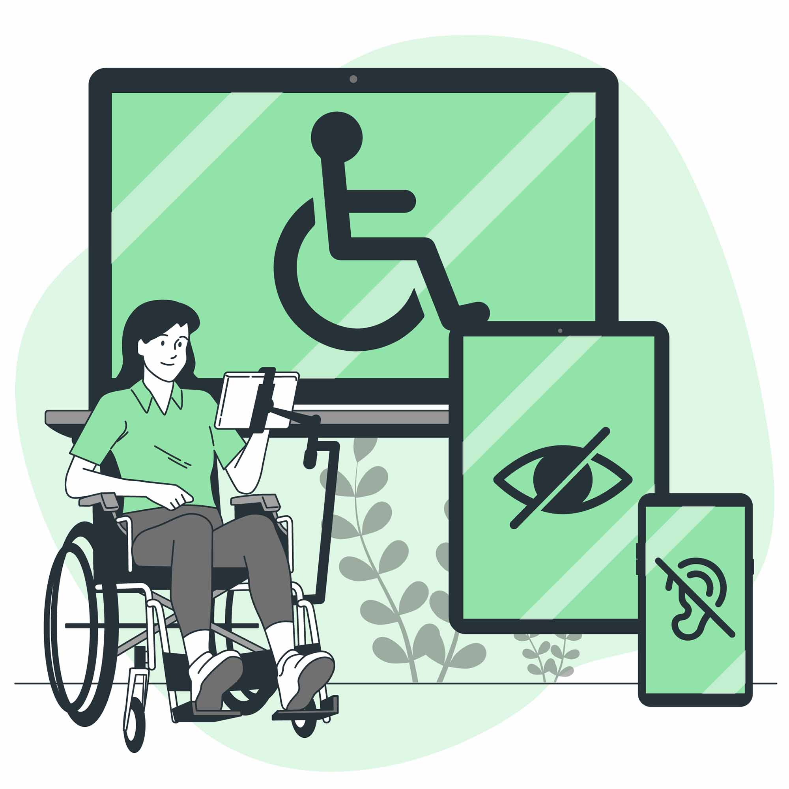

# What is Accessibility

> Accessibility refers to making websites and mobile applications more accessible to people with disabilities when they are using mobile phones and other devices, using a broad range of devices to interact with the web or mobile app.

[Image by storyset](https://www.freepik.com/free-vector/electronic-accessibility-concept-illustration_82646611.htm#query=accessibility&position=4&from_view=keyword&track=sph&uuid=1722d562-791a-4247-a927-3169c7d7a8af)

# Why Accessibility Matters

Approximately 15% of the global population experiences some form of disability, with screen reader, braille and keyboard-only the most common assistive devices/software used.

Accessible UI/UX design often leads to better overall usability, benefiting all users, not just those with disabilities and neurodiversity.

In the UK, one in five people have a disability. Under UK law, organizations have a legal responsibility to ensure their web or mobile app is accessible to this audience.

Accessible websites and apps can reach a wider audience, and furthermore, accessibility improvements often enhance the overall user experience for everyone.

# Accessibility Standards

W3C specified the [Web Content Accessibility Guidelines (WCAG 2.2)](https://www.w3.org/TR/WCAG22/) success criteria for Accessibility compliance. WCAG has 3 levels, and while WCAG Level A allows organisations to cover the basics, WCAG Level AA goes further toward making web content accessible for users in a wider variety of contexts. 

WCAG details accessibility requirements for web and mobile applications, that will provide greater accessibility to a wider range of people with disabilities, across a range of devices (desktops, laptops, tablets and mobile devices).

For mobile apps, [Apple's Human Interface Guidelines](https://developer.apple.com/design/human-interface-guidelines/accessibility) and [Android's Accessibility Principles](https://developer.android.com/guide/topics/ui/accessibility), should also be taken into consideration.

# Start with Accessibility Audit

A good first step is getting an Accessibility audit, which enables you to find out where you are, regarding your web or mobile application accessibility compliance status. The audit can be performed on Android, iOS (plus Mac and Windows, if a web application), and the report will outline non-conformant areas and identifies areas for improvements which can be added to an Accessibility Statement. 

An Accessibility Statement becomes your "living roadmap" for improvements progress, and helpful information about current constrictions.

# Approach to UI/UX Design and Accessibility

WCAG Accessibility standards are broadly broken down into 4 principles with acronym `POUR` (Perceivable, Operable, Understandable, and Robust).
| Perceivable    | Operable | Understandable    | Robust |
| -------- | ------- | -------- | ------- |
| Information and user interface components must be available for access by sight AND through assistive technology like screen readers. | At a minimum, the user must be able to navigate through the data presented with a keyboard or assistive technology. |Information and the operation of the user interface must be understandable. Using color only or complex symbols without secondary means of interpretation should be avoided | Content must be robust enough to be interpreted by assistive technologies, and app should be tested for solid performance. |
|||||

Applying POUR to UI/UX design ensures the web and mobile apps usable by as wide an audience as possible, irrespective of their physical or cognitive abilities. Accessibility around UX extends beyond  compliance with legal standards; it’s about empathetically and proactively designing products that cater to the diverse needs of users witn disabilities (including neurodivergence).

It’s about allowing everyone to participate fully in digital experiences regardless of their abilities. Accessible UX Design often results in a better user experience for all users, not just those with disabilities - features like straightforward navigation and legible text benefit everyone.

> Empathy should be the cornerstone of human-centered design.

# Developing a Company Accessibility Strategy

If your web or mobile app doesn’t follow w3c WCAG standards, from the outset you are creating a difficult path for users of assistive devices.  These drop-offs may not be registered in your app statistics, and users with disabilities will rarely provide feedback - they simply will look for alternatives (far easier).

Developing a company strategy for the design and development cycles, so that standard checks become embedded in ways of working. From design to development, accessibility checks can become the 

# Accessibility tools

Automation tools can help you maintain accessibility and hey are easy to integrate into your current design and development cycles. Many issues found during auditsm are issues that could easily have been picked up on with freely available tools. 

> My next article will dive further into automation, and how to integrate Accessibility into your existing SDLC (Software Development Life Cycle).